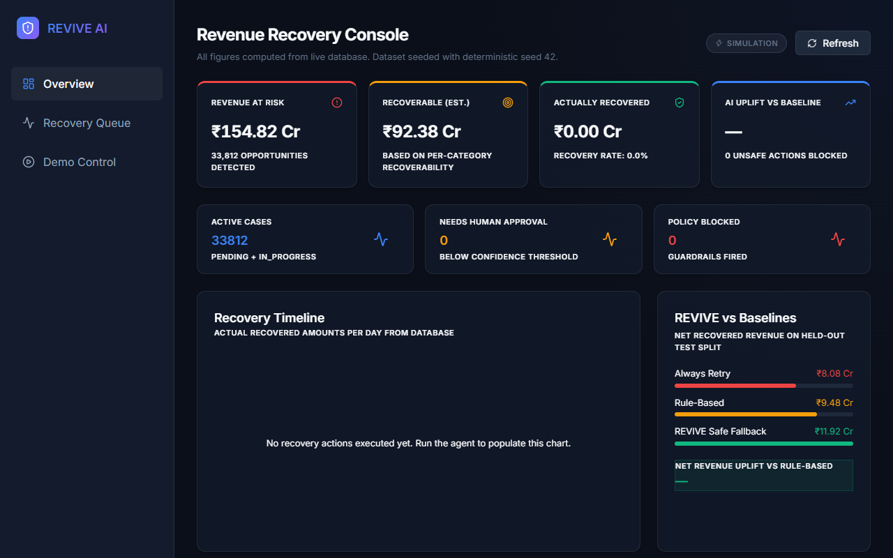
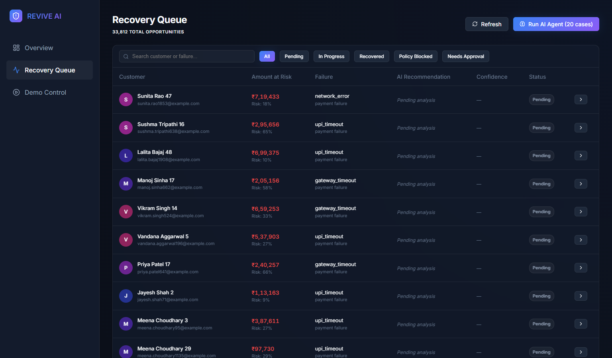
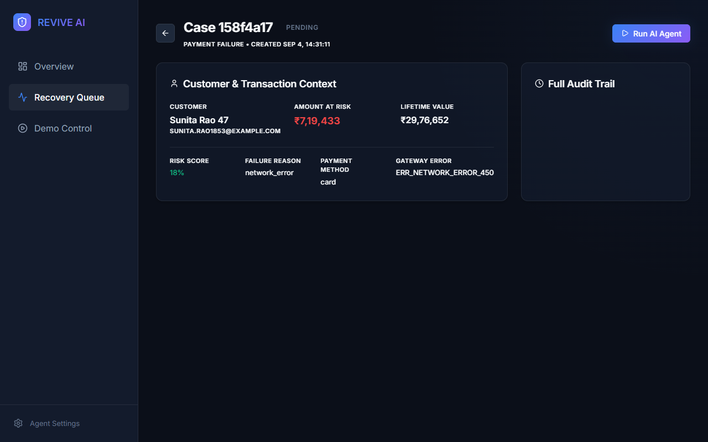
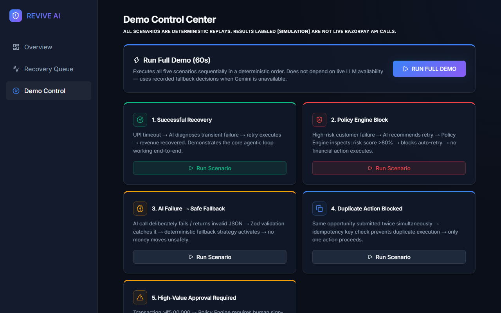

# REVIVE AI

**Autonomous Revenue Recovery Agent**

> **Razorpay AI Buildathon — Track 03: AI Revenue Recovery**  
> Stack: Node.js 24 · TypeScript · Express · node:sqlite · React 19 · Vite · Gemini 1.5 Flash · Zod

---

## The Problem

Most payment retry systems are blind. They map `gateway_timeout → retry in 10 min`. They don't know whether the customer is high-risk, whether they have been messaged three times this week, or whether the transaction is large enough to warrant human review. They retry everything. They spam customers. They execute on fraud signals.

REVIVE fixes this.

---

## Solution

REVIVE is an **agentic decision system** that intercepts failed and abandoned payment events and applies a structured five-step pipeline before any financial action executes:

| Step | Component | What it does |
|---|---|---|
| 1 | **Risk Detector** | Scans events, scores recoverability, creates prioritised opportunity queue |
| 2 | **AI Agent** | Gemini 1.5 Flash reasons about root cause using customer risk, LTV, payment method, history |
| 3 | **Schema Validator** | Zod validates LLM output strictly — malformed output triggers deterministic fallback, always |
| 4 | **Policy Engine** | 8 deterministic rules enforce safety — the LLM *never* authorises financial action |
| 5 | **Executor + Audit** | Executes with idempotency key; every decision, block, and outcome is logged permanently |

The LLM reasons. The policy engine decides. These are not the same component.

---

## Architecture

```
Payment Events (50,000 · seed=42 · reproducible)
    │
    ├── train (70%) — development only
    ├── dev   (15%) — manual testing
    └── test  (15%) — held out until evaluation

Risk Detector (deterministic)
    └── 33,812 recovery opportunities detected

AI Agent (Gemini 1.5 Flash)    Deterministic Safe Fallback (EV model)
    │                                    │
    └─────── Zod Schema Validation ──────┘
                    │ invalid → fallback (always)
             Policy Engine (8 rules, deterministic)
                    │
        ┌───────────┼───────────┐
     BLOCKED    APPROVAL    EXECUTE
        │           │           │
     audit_log  audit_log   audit_log
```

**Stack:** Node.js 24 · Express · TypeScript · `node:sqlite` (experimental) · React 19 · Vite · Recharts · Gemini 1.5 Flash · Zod · Jest

---

## AI Decisioning

The agent is prompted with:
- Customer risk score and lifetime value
- Failure category (`upi_timeout`, `insufficient_funds`, `card_issue`, etc.)
- Prior intervention count for this customer this week
- Payment method and gateway error code

It returns a typed JSON object: `root_cause_category`, `recommended_action`, `confidence`, `rejected_actions` with reasons, and a `stopping_condition`.

**The LLM output is not trusted directly.** Zod validates the schema. The Policy Engine validates the action. The executor runs the action. These are three separate components with no cross-contamination.

---

## Safety Boundary

The Policy Engine enforces 8 hard rules regardless of AI recommendation:

1. Kill switch — if enabled, no actions execute globally
2. Fraud risk — `fraud_risk` category is never retried
3. Risk floor — customer risk score > 0.80 → escalate to human, no auto-retry
4. Transaction cap — amount > ₹5,00,000 → requires human approval
5. Retry limit — more than 3 prior interventions → stop
6. Cooldown — contacted within 24 hours → no new outreach
7. Weekly contact cap — more than 3 messages this week → block
8. Confidence floor — confidence < 0.40 → escalate to human

The LLM **cannot override** any of these rules. It produces recommendations; the policy engine decides.

---

## REVIVE SAFE FALLBACK BENCHMARK

> **Evaluation mode: `deterministic_fallback`**  
> This benchmark does not require a live Gemini API key. Results are fully reproducible.  
> The deterministic fallback uses an Expected Value model: `EV = P(success | failure_category, risk_score) × amount − cost`.  
> REVIVE also supports a live Gemini decision mode, but the benchmark uses the deterministic safe fallback to ensure any judge can reproduce results independently.

**Dataset:** 50,000 events · Seed 42 · Train/Dev/Test split (70/15/15%)  
**Test split:** 5,085 held-out cases — never touched during development  
**Reproduce:** `cd backend && npm run seed && npm run evaluate`

### Benchmark Results (Test Split · 5,085 cases)

| Strategy | Net Recovered Revenue | Recovery Rate | Cases Recovered | Unsafe Actions Blocked (by Policy Engine) |
|---|---:|---:|---:|---:|
| Always Retry | ₹8,08,41,924 | 35.87% | 1,824 | 460 |
| Rule-Based | ₹9,48,44,160 | 46.43% | 2,361 | 171 |
| **REVIVE Safe Fallback** | **₹11,92,16,678** | **52.17%** | **2,653** | **0 (Preemptively avoids unsafe actions)** |

**Uplift over Rule-Based: +₹2,43,72,518 Net Revenue (+5.74 pp recovery rate)**  
**Uplift over Always Retry: +₹3,83,74,754 Net Revenue (+16.30 pp recovery rate)**

> Revenue at risk across the full test split: ₹23.50 Cr

---

## Ablation Study

Proves the impact of each contextual signal. Run with `npm run evaluate -- --ablation`.

| Configuration | Net Revenue | Δ vs Full REVIVE |
|---|---:|---:|
| Full REVIVE (EV model) | ₹11,92,16,678 | — |
| Without risk score | ₹12,73,10,470 | +₹80,93,792 (over-intervention trade-off) |
| Without history | ₹11,92,10,426 | −₹6,252 |

> **Honest Trade-off:** Removing the risk score actually *increases* short-term net revenue by ₹80.9L, because the system blindly retries high-risk accounts. However, this generates immediate revenue at the unacceptable cost of long-term churn, customer complaints, and fraud exposure. The EV model intentionally sacrifices this unsafe revenue to maintain a healthy risk profile.

---

## Failure Handling

Five failure modes explicitly engineered for:

| Failure | What happens |
|---|---|
| Gemini API unavailable | Zod validation fails → deterministic EV fallback activates → `is_fallback=1` logged |
| LLM returns wrong UUID | Wrapper always overrides `opportunity_id` with validated input — never trusts LLM |
| LLM hallucinated action | Zod enum validation rejects unknown action types → fallback |
| Duplicate request | Idempotency key prevents duplicate execution |
| High confidence + high risk | Policy engine still blocks — confidence cannot override safety rules |

---

## Product Screenshots

**1. Executive Dashboard** — Real-time AI vs Baseline performance tracking and Net Revenue impact.


**2. Recovery Queue** — Live queue of 33,812 intercepted failures with per-case AI confidence and recommendation.


**3. Opportunity Detail & Audit Log** — Full decision trace: LLM reasoning, policy engine verdict, financial outcome.


**4. Demo Control Center** — Deterministic scenario replays. No Gemini API required.


---

## Demo Scenarios

All five scenarios are deterministic and work without a live Gemini API key:

| # | Scenario | Demonstrates |
|---|---|---|
| 1 | Successful Recovery | UPI timeout → EV model → retry executes → revenue recovered |
| 2 | Policy Engine Block | High-risk customer → AI recommends retry → Policy Engine blocks with exact rule |
| 3 | AI Failure → Fallback | Invalid API key → Zod fails → `is_fallback=1` → safe degradation |
| 4 | Idempotency | Same opportunity submitted twice → second blocked by idempotency key |
| 5 | High-Value Approval | ₹5L+ transaction → human approval required → audit trail shows reason |

---

## What Broke During Development

**1. `node:sqlite` generic types do not exist.**  
`db.prepare<T>()` — Node 24's experimental SQLite does not support typed prepare. Fixed by casting results at call sites (`as unknown as T`).

**2. Circular dependency on module load.**  
PolicyEngine → database → merchantConfig → policyEngine at import time. Fixed with lazy initialisation: merchant config fetched on first `evaluate()` call.

**3. LLM hallucinated `opportunity_id`.**  
Gemini returned valid JSON with a different UUID. Fixed structurally: the wrapper always overrides the returned ID with the validated input ID before policy evaluation.

**4. `db.transaction()` does not exist on `DatabaseSync`.**  
Node 24 experimental SQLite has no `.transaction()` method. Fixed with explicit `BEGIN/COMMIT/ROLLBACK`.

**5. `Math.random()` made evaluation non-reproducible.**  
Baselines used `Math.random()`. Fixed with a seeded PRNG class — identical results every run from any machine.

---

## Quickstart

```bash
# Prerequisites: Node.js v24.7+

# 1. Clone
git clone https://github.com/gurroopsingh/revive-ai-revenue-recovery
cd revive-ai-revenue-recovery

# 2. Install
cd backend && npm install
cd ../frontend && npm install

# 3. Configure
cp .env.example backend/.env
# Edit backend/.env — set GEMINI_API_KEY (optional; evaluation works without it)

# 4. Generate 50,000-event dataset (reproducible, seed=42)
cd backend && npm run seed
# → 50,000 events | 33,812 opportunities | train/dev/test split

# 5. Run all tests (41 tests — no API key needed)
npm test

# 6. Reproduce the benchmark
npm run evaluate
# → evaluation/results.json  evaluation/report.md

# 7. Start
npm run dev                        # backend: http://localhost:3001
cd ../frontend && npm run dev      # frontend: http://localhost:5173
```

---

## Architecture Docs

| File | Purpose |
|---|---|
| [`docs/agent-decision-flow.md`](docs/agent-decision-flow.md) | What the LLM is and is not trusted to decide |
| [`docs/production-roadmap.md`](docs/production-roadmap.md) | What changes for real Razorpay deployment |
| [`docs/threat-model.md`](docs/threat-model.md) | Adversarial inputs and policy bypass attempts |
| [`docs/evaluation-methodology.md`](docs/evaluation-methodology.md) | Full methodology, assumptions, limitations |
| [`evaluation/report.md`](evaluation/report.md) | Generated benchmark report |
| [`evaluation/results.json`](evaluation/results.json) | Machine-readable results |

---

## Production Roadmap

This is a buildathon prototype. To deploy against real Razorpay:

- Replace `simulateExecution()` in `recoveryWorkflow.ts` with Razorpay API calls
- Replace synthetic outcome simulation with Razorpay webhook callbacks
- Replace `node:sqlite` with PostgreSQL
- Add proper secrets management (Vault / AWS Secrets Manager)
- Add rate limiting per merchant, not globally

See [`docs/production-roadmap.md`](docs/production-roadmap.md) for full detail.

---

## Limitations

- Payment execution is **simulated** — no live Razorpay API calls
- Benchmark outcomes are **synthetically simulated** using per-category probability tables — in production, outcomes come from webhook callbacks
- `node:sqlite` is **experimental** in Node 24 — not recommended for production databases
- Gemini API key is required for live AI reasoning — evaluation runs entirely without it via the deterministic fallback
- Dataset is **synthetic** — real production would require merchant-specific calibration of success probabilities
